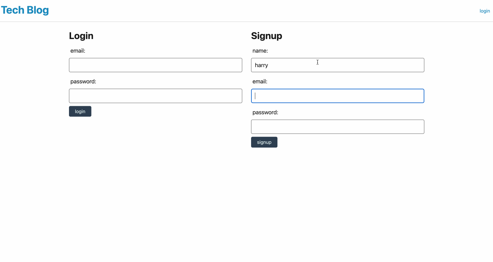

# tech-blog

## Description
An application that allows a user to login to a Tech Blog website and view posts as well as create and delete their own!

## Demo

Quick demo of application and some of its features

## Table of Contents
* [Installion](#installation)
* [Run Application](#run-application)
* [Technologies](#technologies)
* [Questions](#questions)

## Installation
To install necessary dependencies, run the following command:
> npm i

## Run-Application
To seed the database before starting the application, run the following command: 
> npm run seed

To start the application, run the following command:
> npm start

## Technologies
The main technologies used here were Bcrypt, Sequelize, Express.js, Handlebars, and MySQL2.

## Questions
If you have any questions about the repo, open an issue or contact me directly through [email](business.dmjacob@gmail.com). You can find more of my work at [dylanjacob76](https://github.com/dylanjacob76).